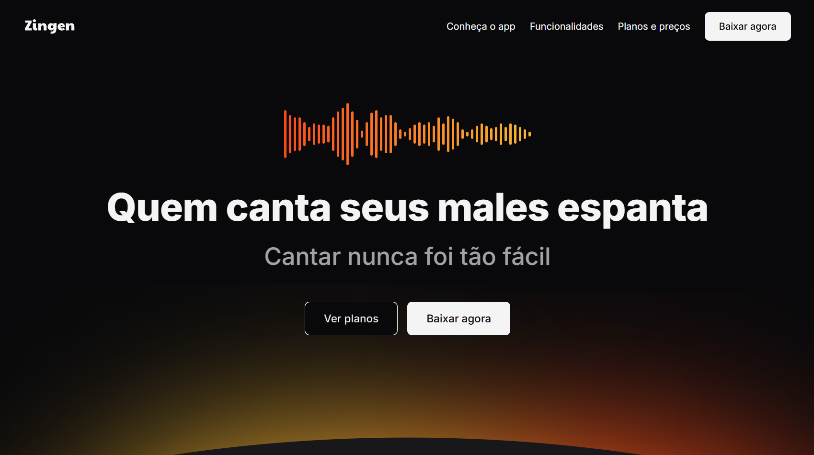

# 📜 Zingen - Karaokê

 

## 📖 Descrição
Este projeto foi desenvolvido junto a **Rocketseat** com o principal objetivo de aprofundar e aprimorar a **responsividade** dos sites, tornando a experiência do usuário mais agradável e acessível.

## 🚀 Tecnologias Utilizadas
- ✅ HTML 
- ✅ CSS

## ⚡ Como Rodar o Projeto
Clone este repositório.
Acesse o diretório do projeto.
Abra o arquivo *index.html* no navegador ou utilize o plugin **Live Server** no VS Code.